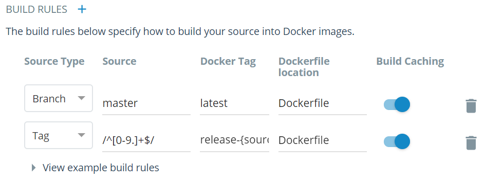

# PreSetup
## GitHub
GitHub is the place that will store all of your hard work and allow you to access it, download it, and change it from anywhere. It also keeps proivious versions if you realy mess up, so you can revert back.

### Interwebs setup
1. Go to [github](https://www.github.com) and either sign in or create an account
2. Over toward the right of the page, click on **New Repository**
3. Give the repository(repo) a short meaningful name. In this instance I named the repo **698-final-project**.
4. You can add a description if you want but leave everything else the same, and hit **Create Repository**.

### Local Setup
**Before Starting:** To get farmiliar with git and git commands I recomend going to [learngitbranching.js.org](http://learngitbranching.js.org/)
1. Use Ubuntu, it makes everything easier.
2. open up a terminal and cd to the place you would like your local repo to live
3. Now type `mkdir 698-final-project` then cd into that folder
4. now type `echo "# Super-awesome-readme-file" >> README.md`
  * This creates a readlme file and adds a heading to it
5. now type `git init`
  * This initializes git in the directory
6. now type `git add README.md`
  * This stages the readme file to be commited
7. now type `git commit -m "first commit"`
  * This commits the readme file with the meassge first _commit_
8. now type `git remote add origin https://github.com/joeshway/I-need-a-repo.git`
  * This adds your online repo as a remote
9. finally type `git push -u origin master`
  * This pushes your local files to the online repo

This will setup an empty github repo to use
***
## Docker Cloud
Docker Cloud is the testing plateform. It will check to see if your repo passes tests that you define and it is where we will be pulling versions from on the web server

1. Go to [Docker Cloud](https://cloud.docker.com) and either sign in or crete an account
2. If you have already connected Docker cloud to Git Hub go to step 7
3. Click on your user name in the top right and select **Cloud Settings from the dropdown
4. Go to **Source Providers** and click on the little plug icon to the right of GitHub
5. Sign in to GitHub
6. Click on the docker cloud icon in the top left
7. At the bottom of the page select **Create Repository**
8. Give it th esame name as your GitHub repo
9. Select the GitHub icon below, and and select the organization, and repo you setup in GitHub
10. Under that click on **Click here to customize the build settings**
11. It should have one setup already for master making a latest tag... leave that one alone and select the + next to build rules.
12. Change the new rule to have the settings below
  - **Source Type:** Tag
  - **Source:** /^[0-9.]+$/
  - **Docker Tag:** release-{sourceref}
  - **Dockerfile location:** Dockerfile
  - **Build Caching:** on
  
13. Now hit the **Create** button at the bottom
14. Lastly go to **builds** for the repo, it should be near the top center of the page.
15. Click **Configure Automated Builds**
16. Set **AUTOTEST** to **Internal Pull Requests**
17. Hit Save down at the bottom

***

# Setting up Docker Files in local repo
Docker needs a few files in your local repo to function. below will show each file you need, how to setup them up, and what they do
At this point I would recomend making a branch by typing `git checkout -b [branch-name]`
### Dockerfile
The Dockerfile is the instructions that run to setup the docker container
1. In the root of your local repo type `sudo nano Dockerfile`
2. In the file add the following code
```bash
FROM ubuntu:xenial

COPY . /src
WORKDIR /src
```

### docker-compose.test.yml
This file points to your test file that will pass or fail your build
1. In the root of your local repo type `sudo nano docker-compose.test.yml`
2. In the file add the following code
```python
sut:
  build: .
  command: bash ./run-tests.sh
```

### run-tests.sh
This file points to the python file with your tests in it
1. In the root of your local repo type `sudo nano run-test.sh`
2. In the file add the following code
```bash
#!/bin/bash

echo "Running Flask Unit Tests"

python3 project_test.py
```

### project_test.py
This file has your tests for docker in it The first time docker runs this it should fail, if it passes double check all of the code is correct
1. In the root of your local repo type `sudo nano project_test.py`
2. In the file add the following code
```python
import unittest

import flask_server

class FlaskrTestCase(unittest.TestCase):

    def setUp(self):
        self.app = flask_server.app.test_client()

    def tearDown(self):
        pass

    def test_home_page(self):
        # Render the / path of the website
        rv = self.app.get('/')
        # Chech that the page contians the desired phrase
        assert b'Hello World' in rv.data

if __name__ == '__main__':
    unittest.main()
```
This will check if the home page has **hello world** somewhere on it.
***
### At this point we should get these new files up on git hub
1. Type `git status` to see what files have been added, or changed.
2. Type `git add -A`. At this point it is fine to all all of the files, however in the future you can add specific files by typing `git add [file-name]`
3. Type `git commit -m "A super informative commit message". When committing try to make the message informative that way if someone else were to look at them, they would know what was changed.
4. Type `git push orgin [branch-name]`. This is what ever you used when making the branch.
5. Open a browser and go to [github.com](https:\\github.com)
6. Go to your repo and create a pull request into master
7. If Docker is setup correctly you should now see tests pending near the merge button
8. Open a new tab and go to [cloud.docker.com](https://cloud.docker.com)
9. Select repositories near the top, and select the one you made earlier.
10. On the right you should see your build. If you select it, you will see the status along with a log of what is going on.
11. **DO NOT** merge the pull request (not a huge deal if you did)

# Adding to the Dockerfile
After this section the tests still won't pass, but it shouldn't fail as early...

Since the Dockerfile is the instructions on how to setup the container we need to add some code to it so it sets up the server correctly
The first time you run the test it will take a bit longer, however docker caches commands, so the second time should be faster.
One catch is that if one line in the Dockerfile changes all lines after it will not use the cached version.

1. in the root of the repo type `sudo nano Dockerfile`
2. directly after the first line add this code
```
RUN apt-get update -y
RUN apt-get install -y python3 python3-pip python3-dev build-essential
```
The entire file should look like this
```
FROM ubuntu:xenial

RUN apt-get update -y
RUN apt-get install -y python3 python3-pip python3-dev build-essential

COPY . /src
WORKDIR /src

```
This will install most of the packages you need

If you would like you can add, commit, and push to github and create a pull request again to see what changes

# Flask
Flask is the backend to the web server. it is written in python. For some more info on flask checkout [http://flask.pocoo.org/](http://flask.pocoo.org/)
For now we will set this up to pass our test that we setup

1. in the root of the repo type `sudo nano flask_server.py`
2. add this code to the file
```python
from flask import Flask
app = Flask(__name__)

@app.route('/')
def mainRoute():
    return 'Hello World'

if __name__ == '__main__':
    app.run(debug=True,host='0.0.0.0')
```
3. You are also going to have to add another line to you Dockerfile
4. You should know how to edit files at this point... edit the Docker file and add the line below smoewhere above `COPY . /src` and below `RUN apt-get install...`

```
RUN pip3 install Flask
```
If you notice we are installing Flask with pip3. This is because Flask is a python app
***
Go ahead and push this up to GitHub. make a pull request, and go to Docker Cloud. 

If everything was done correctly your test should pass, or succeed as docker puts it

Assuming your test passed, you can now merge into master. 

# Tagging
At this point we should make a tag. this is a way in git to add a marker to a place in the timeline that is easly found. This also integrates with Docker Cloud, we will talk about that in a bit.

1. To do this type `git checkout master` at the root of your local repo.
2. Now type `git tag 0.0.1` the first number is a major release, the second is minor release, and the third is bugcheck or small change that does not break anything
3. type `git push --tags`
4. now in Docker Cloud you should see a new test running on that tag number
5. When you make a new tag do the same as above, but increment what ever number fits the changes you made.

# Setting up Flask the better way
Now that the test has passed, lets change some things.

Since flask is a web server, we should make it return HTML files, instead of just plain text.
1. Make a folder in the rood of the repo called templates. `mkdir templates`
2. Now cd into that folder
3. Lets make a basic HTML home page that will still pass our test
4. Type `sudo nano index.html`
5. Now add the code below
```html
<html>
  <head>
  </head>
  <body>
    <h1>Hello World</h1>
  </body>
</html>
```
6. Now that we have an HTML file we need to point flask to it.
7. edit the flask_server.py file
8. On the first line after Flask add a comma then a space, and type `render_template`
9. now where you have `'Hello World'` remove that including the quotes and add `render_template('index.html')`

The file should look like this
```python

from flask import Flask, render_template
app = Flask(__name__)

@app.route('/')
def mainRoute():
    return render_template('index.html')

if __name__ == '__main__':
    app.run(debug=True,host='0.0.0.0')
``` 
10. Flask will now load that HTML file

#Ansible
Ansible is a way of auto setting up a server using yml files.

We will pe using it to deploy a staging and production server on an AWS instance.

Before we get to AWS, lets setup ansible

1. in the root of the project create a folder called **ansible** `mkdir ansible`
2. cd into ansible and make another folder called roles, but do not cd into it
### We need to create 4 files in the ansible folder
**ansible.cfg**
1. type `sudo nano ansible.cfg`
2. Add the line `[localhost]` to it, and that is it

**configure-host.yml**
This will install and run the community version of docker
1. type `sudo nano configure-host.yml`
2. add this code to the file
```
---
- name: Install the community edition of docker
  hosts: localhost
  become: true
  roles:
    - docker
```
**deploy-website-production.yml**
This will start the production server. The **server_host_port** should be the open port on the AWS instance for the production server and **server_image_version** is the version of the site on docker cloud you want to use
1. type `sudo nano deploy-website-production.yml`
2. add this code to the file
```
---
- name: Deploy the production version
  hosts: localhost
  become: true
  vars:
    server_environment: production
    server_image_version: release-0.0.2
    server_host_port: 8080
    server_container_port: 5000
  roles:
    - server
```
**deploy-website-staging.yml**
This will start the staging server. The **server_host_port** should be the open port on the AWS instance for the staging server and **server_image_version** is the version of the site on docker cloud that you want to use
1. type `sudo nano deploy-website-staging.yml`
2. add this code to the file
```
---
- name: Deploy the staging version
  hosts: localhost
  become: true
  vars:
    server_environment: production
    server_image_version: release-0.0.2
    server_host_port: 8081
    server_container_port: 5000
  roles:
    - server
```
***
here is a tree to refer back to on the file structure of the ansible folder
```
ansible
|  ansible.cfg
|  configure-hgost.yml 
|  deploy-website-production.yml
|  deploy-website-staging.yml
|--roles
   |--docker
   |  |--handlers
   |  |  |  main.yml
   |  |
   |  |--tasks
   |     |  install.yml
   |     |  main.yml
   |     |  service.yml
   |     |  user.yml
   |
   |--server
      |--tasks
      |  |  main.yml
      |
      |--vars
         |  main.yml
```
***
## roles
### docker
#### handlers
##### main.yml
```
---
- name: apt-get update
  apt:
    update_cache: yes
    cache_valid_time: 1800
```
***
## roles
### docker
#### tasks
##### install.yml
```
---
# Install the docker service
- name: install docker dependencies
  apt:
    pkg: '{{ item }}'
    update_cache: yes
    cache_valid_time: 1800
  with_items:
    - apt-transport-https
    - ca-certificates
    - curl
    - software-properties-common

# Add docker's GPG key
- name: Setup docker repository key
  apt_key:
    id: 0EBFCD88
    url: https://download.docker.com/linux/ubuntu/gpg
    state: present
  notify: apt-get update

# This command runs on the server to determine what version of ubuntu is running
# The command's output to `lsb_release -c -s` is saved in `release` and
# available for the next step.
- name: Get release
  command: lsb_release -c -s
  register: release

# Here we add docker's repository to allow the system to do an apt-get install of
# official docker packages.
# http://docs.ansible.com/ansible/apt_repository_module.html
- name: Add docker repo
  apt_repository:
    repo: deb [arch=amd64] https://download.docker.com/linux/ubuntu {{ release.stdout }} stable
    state: present
    filename: docker
  notify: apt-get update

# Install the docker service.  Fix the name of the package.
# http://docs.ansible.com/ansible/apt_module.html
- name: Install the latest version of docker community edition
  apt:
    pkg: docker-ce
    update_cache: yes
    cache_valid_time: 1800
```
##### main.yml
```
---

- include: install.yml
- include: user.yml
- include: service.yml
```
##### service.yml
```
---
# This should ensure that the docker service is running.
# See the following for usage hints:
# http://docs.ansible.com/ansible/service_module.html
- name: Ensure docker service is started
  service:
    name: docker.service
    state: started
```
##### user.yml
```
---
- name: Adding user to group docker
  user:
    name: "{{ student_name }}"
    group: docker
    append: yes
```
***
## roles
### server
#### tasks
##### main.yml
```
---
# The following python package is required for ansible to interact with
# the docker service to manage docker containers.
- name: Ensure python docker-py package is installed
  pip:
    name: docker-py

- name: Start/Restart the container
  docker_container:
    name: "server-{{ server_environment }}"
    image: "{{ server_image }}:{{ server_image_version }}"
    command: "{{ server_command }}"
    state: started
    ports:
     - "{{ server_host_port }}:{{ server_container_port }}"

- name: verify that webserver is running
  uri:
    url: http://{{ aws_ip }}:{{ server_host_port }}
    method: GET
```
***
## roles
### server
#### vars
##### main.yml
```
---
server_image: <docker User Name>/698-final-project
server_command: python3 /src/flask_server.py
aws_ip: <AWS server IP>
```
***
